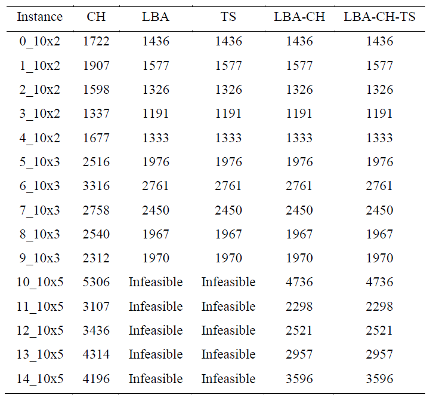
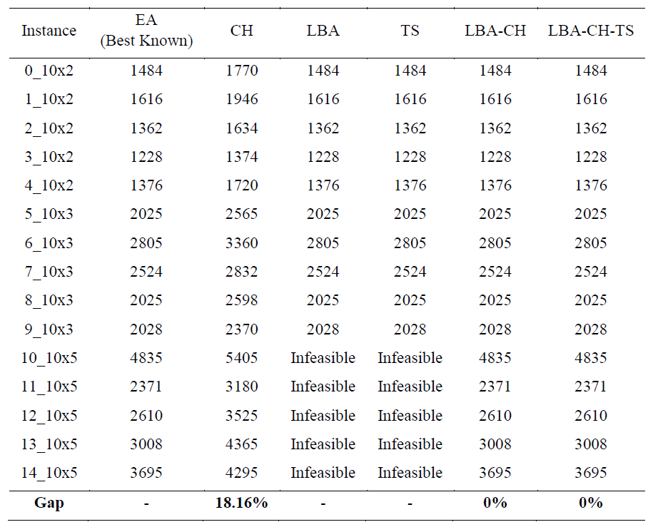

# DSS_SMS_TS_EvoLovebird

To run the program: (1) unzip the files, (2) add the folder in MATLAB (“Browse for folder”), (3) add the paths for all folders inside MATLAB CODE DSS for preemptive single machine scheduling (“Add to path > selected folders and subfolders”), (4) open the proposed algorithms file (there are four algorithm combinations), and (5) match the dataset file name with the report by setting Job_processing_time = 3; %3,5,2, number_instance = 8; %0-14, and number_jobs = 10;. The reported dataset uses 10 jobs with processing time 2, 3, or 5, instance names 0–14, and corresponding .png files in the folder.

To run the GUI: (1) open Design App in MATLAB, (2) add the folder GUI > SingleMachineSchedulingApp, (3) open Preemprive_SMS_Apps.mlapp, (4) click Run (adjust iteration and population parameters for the Lovebird algorithm experiments), and (5) to change datasets, use the files in the Dataset folder; the full dataset is from Fomin & Goldengorin (2022) and can be run using the .txt format like 1_10x2.txt, matching all data used in the report. Data availability: the dataset supporting the study is openly available on Mendeley Data (nrkx7467tf/1), referenced as Fomin and Goldengorin (2020). Additional note: the MATLAB program’s default objective function is Total Weighted Flow Time (TWFT); to switch to the reference paper’s objective (TWCT, per Fomin & Goldengorin, 2022), in each “proposed algorithm” file you must change only the cost line c = c + second_jp_idx(j)*job_weight - time_release; to c = c + second_jp_idx(j)*job_weight; (no other code changes), because TWCT should not subtract time_release; objective-specific filenames are already labeled as TWFT or TWCT.

Check out the [Project Presentation Slides](https://docs.google.com/presentation/d/1d8O0vIMrle2I6gbELP2miumBP-xMGy9VikK_FVsYdYE/edit?usp=sharing) for more details.

## TWFT Result

## TWCT Result

